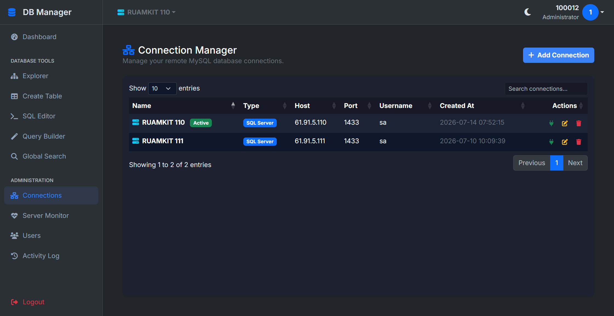

# AI Web Database Manager

**AI Web Database Manager** เป็นแอปพลิเคชันบนเว็บที่เขียนด้วย PHP แบบ Native (ไม่ใช้ Framework ที่ซับซ้อน) สร้างขึ้นมาเพื่อเป็นเครื่องมือจัดการฐานข้อมูลผ่านเบราว์เซอร์ โดยมุ่งเน้นที่ความสวยงาม ทันสมัย ใช้งานง่าย และความรวดเร็ว

ระบบนี้รองรับการจัดการฐานข้อมูลทั้ง **MySQL / MariaDB** และ **SQL Server (MSSQL)** รองรับการสลับฐานข้อมูลไปมาได้อย่างรวดเร็ว

## 🚀 คุณสมบัติหลัก (Features)

- **Connection Manager**: จัดการการเชื่อมต่อฐานข้อมูลได้หลายเครื่อง (Multiple Database Connections) รองรับทั้ง MySQL และ SQL Server พร้อมฟังก์ชันทดสอบการเชื่อมต่อ
- **Database Explorer**: ดูโครงสร้างฐานข้อมูล, รายชื่อตาราง และข้อมูลในตาราง
- **Data Viewer / Editor**: ดูข้อมูลในตาราง พร้อมฟังก์ชันแก้ไข (Edit) และเพิ่ม (Insert) ข้อมูล
- **SQL Editor**: ช่องสำหรับพิมพ์คำสั่ง SQL ด้วยตัวเอง พร้อมแสดงผลลัพธ์
- **User Management**: มีระบบล็อกอินและการจัดการผู้ใช้งานภายใน (เก็บข้อมูลด้วย SQLite)
- **Activity Log**: บันทึกประวัติการกระทำต่างๆ ในระบบ
- **Responsive & Modern Design**: อินเทอร์เฟซทันสมัย ธีมโหมดมืด (Dark Mode) และรองรับการใช้งานบนมือถือ

## ⚙️ ความต้องการของระบบ (Requirements)

- **PHP**: เวอร์ชัน 7.4 หรือ 8.0 ขึ้นไป
- **Extensions (สำหรับ PHP)**:
  - `pdo`
  - `pdo_sqlite` (สำหรับเก็บข้อมูลการตั้งค่าและ User ของระบบ)
  - `pdo_mysql` (หากต้องการเชื่อมต่อ MySQL/MariaDB)
  - `pdo_sqlsrv` และ `sqlsrv` (หากต้องการเชื่อมต่อ Microsoft SQL Server)
- **Web Server**: Apache, Nginx, หรือ LiteSpeed (ระบบมีการใช้ `.htaccess` สำหรับการทำ URL Rewrite)

## 🛠️ วิธีการติดตั้ง (Installation)

1. คัดลอก (Clone) หรือดาวน์โหลดไฟล์โปรเจกต์ทั้งหมดไปไว้ในโฟลเดอร์ Web Server ของคุณ (เช่น `htdocs`, `www`, หรือ `public_html`)
2. คัดลอกไฟล์ `.env.example` แล้วเปลี่ยนชื่อเป็น `.env`
3. ตั้งค่าต่างๆ ในไฟล์ `.env` (ตัวเลือกเริ่มต้นจะใช้ `sqlite` สำหรับเก็บข้อมูลผู้ใช้งาน ซึ่งระบบจะสร้างไฟล์ให้เองอัตโนมัติ)
4. หากคุณใช้งานบน Share Hosting หรือเซิร์ฟเวอร์จำลอง (เช่น XAMPP, AppServ) ระบบมีไฟล์ `.htaccess` คอยชี้ทางให้แล้ว สามารถเข้าใช้งานผ่าน URL หน้าโฟลเดอร์ได้เลย
5. ล็อกอินเข้าใช้งานด้วยบัญชีผู้ดูแลระบบ (หากติดตั้งครั้งแรก ระบบอาจจะให้สร้างผู้ดูแลระบบก่อน หรือใช้ข้อมูลตั้งต้นตามที่กำหนด)

## การติดตั้งบน IIS และแก้ปัญหา `/login` เป็น 404

1. ใน IIS Manager เลือกเว็บไซต์ → **Basic Settings** → ตั้ง **Physical Path** เป็นโฟลเดอร์ `AI-WebDatabaseManager\public` (แนะนำ)
2. คัดลอก **`public/web.config`** ไปไว้ในโฟลเดอร์นั้น ให้อยู่ข้าง `index.php` และ `assets` โดยคงชื่อไฟล์เป็น `web.config` ไม่ใช่ `web.config.txt`
3. ตรวจว่า IIS มี **URL Rewrite Module** และที่หน้า **URL Rewrite** ของเว็บไซต์เห็นกฎ `DB Manager application routes` ที่เปิดใช้งานอยู่
4. เปิด `/login` อีกครั้ง กฎต้องส่งคำขอไปยัง `index.php` ภายในเซิร์ฟเวอร์ โดย URL ในเบราว์เซอร์ยังเป็น `/login` และไฟล์ `/assets/css/style.css` ต้องตอบกลับเป็น CSS

ถ้าจำเป็นต้องตั้ง Physical Path เป็นโฟลเดอร์โปรเจกต์ ให้ใช้ `web.config` ที่รากโปรเจกต์ร่วมกับ `public/web.config` ตามโครงสร้างเดิม กฎที่รากจะส่ง route เช่น `/login` ไป `public/index.php` โดยตรง และส่ง `/assets/...` ไป `public/assets/...`

**อย่านำ `web.config` ที่รากโปรเจกต์ไปวางแทน `public/web.config`** เพราะใช้ปลายทาง rewrite คนละตำแหน่ง

การแยกสาเหตุ:

- `/` ตอบ `302` ไป `/login` แต่ `/login` เป็นหน้า 404 ข้อความสั้นจาก IIS: PHP ทำงานแล้ว แต่ต้องตรวจว่าไฟล์ rewrite ถูก deploy และถูกโหลดจาก Physical Path ที่ถูกต้อง
- `/index.php` ตอบหน้าแอปที่มีสถานะ 404: PHP ทำงาน แต่ URL นี้ไม่ใช่ route ที่แอปลงทะเบียนไว้ ให้เข้า `/login` ผ่าน rewrite
- ถ้าได้ `500.19` หลังวางไฟล์: ตรวจรายละเอียด error ของ IIS ว่าขาด URL Rewrite Module หรือ configuration section ถูกล็อก
- ไม่ต้องเรียก `setup.php` หรือสร้างฐานข้อมูลใหม่เพื่อแก้ปัญหา rewrite

อ้างอิง: [Microsoft IIS URL Rewrite configuration](https://learn.microsoft.com/en-us/iis/extensions/url-rewrite-module/url-rewrite-module-configuration-reference)

## 🌐 การนำไปใช้งานบน Share Hosting

ระบบนี้ออกแบบมาให้พร้อมนำไปใช้งานบน Share Hosting ได้ทันที 
* **จุดที่ต้องระวัง 1**: โปรดแน่ใจว่าโฟลเดอร์ `database/` มีสิทธิ์ให้ PHP สามารถเขียนไฟล์ได้ (Write Permission) เพื่อให้สามารถสร้างและบันทึกไฟล์ `system.sqlite` ได้
* **จุดที่ต้องระวัง 2**: โฮสติ้งบางแห่งอาจมีการตั้งค่า Firewall บล็อกการเชื่อมต่อออกภายนอกไปยังพอร์ต 3306 (MySQL) หากเพิ่มฐานข้อมูลภายนอกแล้วทดสอบไม่ผ่าน ให้แจ้ง Support ของโฮสติ้งให้ช่วยเปิดพอร์ตครับ
* **เกี่ยวกับ SQL Server**: หากโฮสติ้งของคุณไม่มี Extension `pdo_sqlsrv` ระบบจะทำการซ่อนตัวเลือก SQL Server ให้โดยอัตโนมัติ เพื่อป้องกันการเกิดข้อผิดพลาด

## 📄 License
This project is open-sourced software.
